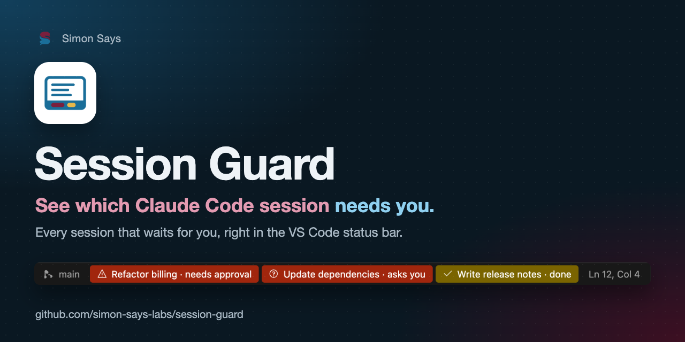

<p align="center"></p>

# Session Guard

<p align="center"><b><a href="#deutsch">🇩🇪 Deutsch</a> · <a href="#english">🇬🇧 English</a> · <a href="docs/README.fr.md">🇫🇷 Français</a> · <a href="docs/README.it.md">🇮🇹 Italiano</a> · <a href="docs/README.es.md">🇪🇸 Español</a></b></p>

> 🇩🇪 **Auf einen Blick sehen, welche Claude-Code-Sitzung dich braucht.** Session Guard zeigt in der
> VS-Code-Statusleiste jede Sitzung, die auf dich wartet: rot bei Freigabe oder Frage, gelb, wenn eine Antwort fertig
> ist. Ein Klick wechselt in die Sitzung, ein Ton kommt nur bei einer echten Frage.
>
> 🇬🇧 **See at a glance which Claude Code session needs you.** Session Guard puts every session that is waiting for
> you into the VS Code status bar: red for an approval or a question, yellow when a turn has finished. One click
> switches to the session, and a sound plays only when you are actually asked a question.


*Die Statusleiste mit einer Sitzung, die auf Freigabe wartet (rot), und einer fertigen (gelb), hier mit deutscher
Oberfläche. · The status bar with a session waiting for approval (red) and a finished one (yellow), here with the
German UI.*


*Alle drei Eintragsarten mit englischer Oberfläche: Freigabe und Frage (rot), fertige Antwort (gelb). · All three
entry types with the English UI: approval and question (red), finished turn (yellow).*

## Deutsch

Du arbeitest mit mehreren Claude-Code-Chats nebeneinander in VS Code. Einer stellt eine Frage, einer wartet auf eine
Freigabe, ein dritter ist fertig, und du merkst es erst, wenn du alle durchklickst. Session Guard bringt jede
Sitzung, die auf dich wartet, in die Statusleiste von VS Code und spielt nur dann einen Ton, wenn dir wirklich eine
Frage gestellt wird.

### Funktionen

- **Ein Eintrag je wartender Sitzung**, beschriftet mit dem Sitzungstitel aus der Sitzungsliste von Claude Code.
  - 🟥 **rot:** Claude braucht deine Freigabe oder stellt dir eine Frage
  - 🟨 **gelb:** Claude hat eine Antwort fertig, die du angestoßen hast
- **Klick zum Wechseln:** lädt die Sitzung in die Claude-Code-Seitenleiste und entfernt den Eintrag. Kein zweiter
  Chat-Tab.
- **Beim Darüberfahren** siehst du, wie lange die Sitzung schon wartet, und die Frage oder die letzte Zeile.
- **Ton nur bei Fragen** (AskUserQuestion, MCP-Eingabedialoge, Hintergrundsitzungen, die auf eine Eingabe warten).
  Freigaben und fertige Antworten bleiben still.
- **Keine Fehlalarme** bei Antworten, die nicht wirklich fertig sind:
  - Claude macht von selbst weiter (zum Beispiel nach einem Stop-Hook): der Eintrag verschwindet.
  - Hintergrundaufgaben der Sitzung laufen noch: es erscheint nichts, bis sie fertig sind.
  - Die Antwort wurde von einem Zeitplan angestoßen (`/loop`, Cron): es erscheint nichts.
- Einträge verschwinden, wenn du antwortest, wenn Claude weitermacht, wenn du sie anklickst oder (nur gelbe) nach
  60 Minuten.
- Oberfläche auf Deutsch, Englisch, Französisch, Italienisch und Spanisch (folgt der Anzeigesprache von VS Code).
- Alles bleibt auf deinem Rechner. Kein Netzzugriff, keine Telemetrie.

### So funktioniert es

```
Claude-Code-Sitzung ──Hook──▶ ~/.local/state/session-guard/sessions/<id>.json ──▶ VS-Code-Erweiterung ──▶ Statusleiste
                                                                       ▲
                          Sitzungsverlauf (~/.claude/projects/…) ┘  „wartet sie noch?“
```

Das Repository hat zwei Teile:

| Teil | Was er tut |
|---|---|
| **Claude-Code-Plugin** (`hooks/`) | Ein Hook auf `Stop`, `PreToolUse` (AskUserQuestion) und `Notification` schreibt je Sitzung eine kleine JSON-Statusdatei und spielt den Ton bei Fragen. |
| **VS-Code-Erweiterung** (`vscode/`) | Liest die Statusdateien alle zwei Sekunden, prüft im Sitzungsverlauf, ob die Sitzung noch wartet, und zeigt die Einträge in der Statusleiste. |

### Voraussetzungen

- Claude Code mit Plugin-Unterstützung, genutzt in der VS-Code-Erweiterung
- VS Code 1.90 oder neuer
- Python 3.9 oder neuer im `PATH`: als `python3` auf macOS und Linux, als `python` auf Windows (der Hook nutzt nur
  die Standardbibliothek)
- macOS, Linux oder Windows 10/11. **Windows:** das Plugin aus dem [Zweig `windows`](https://github.com/simon-says-labs/session-guard/tree/windows)
  installieren (siehe unten), die VS-Code-Erweiterung ist für alle Systeme dieselbe.

### Installation

#### 1. Claude-Code-Plugin (der Hook)

In einer Claude-Code-Sitzung:

```
/plugin marketplace add simon-says-labs/session-guard
/plugin install session-guard@simon-says
```

#### 2. VS-Code-Erweiterung

`session-guard-<version>.vsix` aus dem [neuesten Release](https://github.com/simon-says-labs/session-guard/releases/latest)
laden und ausführen:

```bash
code --install-extension session-guard-*.vsix
```

Wer [VS-Code-Profile](https://code.visualstudio.com/docs/configure/profiles) nutzt, installiert sie in jedes Profil,
in dem er arbeitet, zum Beispiel mit `--profile Work`. Ohne `--profile` landet sie nur im Standardprofil.

Danach das VS-Code-Fenster neu laden (**Developer: Reload Window**). Das startet auch die Claude-Code-Sitzungen in
diesem Fenster neu: Claude Code lädt ein neu installiertes oder aktualisiertes Plugin erst beim Start einer Sitzung;
laufende Sitzungen behalten bis dahin die alten Hooks (oder keine).

### Einstellungen

| Umgebungsvariable | Wirkung |
|---|---|
| `SESSION_GUARD_SOUND=off` | Gar kein Ton |
| `SESSION_GUARD_STATE=/pfad` | Anderer Zustandsordner (für Claude Code **und** VS Code setzen) |

Jedes Ereignis steht mit `sound=yes|no` in `~/.local/state/session-guard/session-guard.log` (Windows:
`%LOCALAPPDATA%\session-guard\session-guard.log`); dort lässt sich nachlesen, warum ein Ton kam oder nicht.

### Grenzen

Bitte vor dem Verlassen auf die Erweiterung lesen:

- **Interne Befehle.** Der Klick nutzt interne Befehle der Claude-Code-Erweiterung für VS Code
  (`claude-vscode.sidebar.open` und `claude-vscode.editor.open`), zuletzt geprüft mit Version 2.1.288. Sie sind keine
  öffentliche Schnittstelle und können sich ändern. Schlagen sie fehl, nutzt Session Guard die dokumentierte URI
  `vscode://anthropic.claude-code/open?session=<id>`, die die Sitzung eventuell in einem neuen Tab öffnet.
- **Format des Sitzungsverlaufs.** Ob eine Sitzung noch wartet, wird aus den Sitzungsverläufen von Claude Code
  gelesen. Ihr Format ist nicht offiziell dokumentiert.
- **Seitenleisten-Einstellung.** Ein Klick setzt den bevorzugten Ort der Claude-Code-Erweiterung auf die
  Seitenleiste (`claudeCode.preferredLocation`).
- **Windows braucht für das Plugin den [Zweig `windows`](https://github.com/simon-says-labs/session-guard/tree/windows).** `hooks/hooks.json` gilt für
  alle Systeme, und es gibt keinen Aufruf, der überall funktioniert: Unter Windows ist `python3` oft nur der
  Platzhalter des Microsoft Store (Exit-Code 49), unter macOS fehlt meist `python`. Der Zweig unterscheidet sich von
  `main` nur in dieser einen Datei (Aufruf `python` ohne Shell, Git Bash nicht nötig); die CI prüft das. Installation:
  `/plugin marketplace add simon-says-labs/session-guard#windows`, dann `/plugin install session-guard@simon-says`.
  Ist Python nicht installiert, ist auch `python` nur dieser Platzhalter und der Hook bleibt stumm; Abhilfe: Python
  von python.org mit „Add python.exe to PATH“. Der Ton kommt auf Windows über `winsound`, der Zustand liegt in
  `%LOCALAPPDATA%\session-guard`.
- **Große Sitzungsverläufe.** Der Hook liest den Verlauf einmal je Ereignis. Bei 40 bis 60 MB dauert das auf einem
  Apple M4 Pro etwa 0,75 s.

### Deinstallieren

```
/plugin uninstall session-guard@simon-says
code --uninstall-extension simon-says-labs.session-guard
```

Den Zustandsordner `~/.local/state/session-guard` (Windows: `%LOCALAPPDATA%\session-guard`) kannst du danach
entfernen.

### Entwicklung

```bash
python3 -m unittest discover -s tests/python   # Hook
node --test tests/node/*.test.js               # Erweiterung
python3 vscode/build_vsix.py                   # schreibt dist/session-guard-<version>.vsix
claude plugin validate .                       # Plugin- und Marketplace-Manifeste
```

Die Erweiterung hat keine npm-Abhängigkeiten und braucht keinen Build-Schritt. Siehe
[CONTRIBUTING.md](CONTRIBUTING.md).

### Lizenz

[MIT](LICENSE) © 2026 Simon Eckmiller · veröffentlicht von [Simon Says](https://github.com/simon-says-labs)

Ein unabhängiges Community-Projekt, nicht verbunden mit Anthropic und nicht von Anthropic unterstützt.

<p align="right"><a href="#session-guard">↑ Zur Sprachauswahl</a></p>

## English

You run several Claude Code chats side by side in VS Code. One asks a question, another
waits for an approval, a third has finished, and you only notice when you click through
all of them. Session Guard puts every session that is waiting for
you into the VS Code status bar, and plays a sound only when you are actually asked a
question.

### Features

- **One entry per waiting session**, labelled with the session title from Claude Code's
  session list.
  - 🟥 **red**: Claude needs your approval or asks you a question
  - 🟨 **yellow**: Claude finished a turn you started
- **Click to switch**: loads that session into the Claude Code side bar and dismisses the
  entry. No second chat tab.
- **Hover** shows how long the session has been waiting and the question or last line.
- **Sound only for questions** (AskUserQuestion, MCP input dialogs, background sessions
  waiting for input). Approvals and finished turns stay silent.
- **No false alarms** from turns that are not really finished:
  - Claude continues on its own (for example after a Stop hook): the entry disappears.
  - Background tasks of the session are still running: nothing is shown until they finish.
  - The turn was started by a schedule (`/loop`, cron): nothing is shown.
- Entries disappear when you answer, when Claude continues, when you click them, or (yellow
  only) after 60 minutes.
- User interface in English, German, French, Italian and Spanish (follows the VS Code display language).
- Everything stays on your machine. No network access, no telemetry.

### How it works

```
Claude Code session ──hook──▶ ~/.local/state/session-guard/sessions/<id>.json ──▶ VS Code extension ──▶ status bar
                                                                       ▲
                              session transcript (~/.claude/projects/…) ┘  "is it still waiting?"
```

The repository contains two parts:

| Part | What it does |
|---|---|
| **Claude Code plugin** (`hooks/`) | A hook on `Stop`, `PreToolUse` (AskUserQuestion) and `Notification` writes one small JSON status file per session and plays the question sound. |
| **VS Code extension** (`vscode/`) | Reads the status files every two seconds, checks the session transcript to see whether the session is still waiting, and shows the status bar entries. |

### Requirements

- Claude Code with plugin support, used in the VS Code extension
- VS Code 1.90 or later
- Python 3.9 or later on your `PATH`: as `python3` on macOS and Linux, as `python` on Windows (the hook uses the
  standard library only)
- macOS, Linux or Windows 10/11. **Windows:** install the plugin from the [`windows` branch](https://github.com/simon-says-labs/session-guard/tree/windows)
  (see below); the VS Code extension is the same on every system.

### Installation

#### 1. Claude Code plugin (the hook)

In a Claude Code session:

```
/plugin marketplace add simon-says-labs/session-guard
/plugin install session-guard@simon-says
```

#### 2. VS Code extension

Download `session-guard-<version>.vsix` from the
[latest release](https://github.com/simon-says-labs/session-guard/releases/latest) and run:

```bash
code --install-extension session-guard-*.vsix
```

If you use [VS Code profiles](https://code.visualstudio.com/docs/configure/profiles), install
it into each profile you work in, for example `--profile Work`. An extension installed without
`--profile` lands in the default profile only.

Reload the VS Code window afterwards (**Developer: Reload Window**). This also restarts the Claude Code
sessions in that window: Claude Code loads a newly installed or updated plugin only when a session
starts, so running sessions keep the old hooks (or none) until then.

### Configuration

| Environment variable | Effect |
|---|---|
| `SESSION_GUARD_SOUND=off` | No sound at all |
| `SESSION_GUARD_STATE=/path` | Different state directory (set it for Claude Code **and** VS Code) |

Every event is logged with `sound=yes|no` in `~/.local/state/session-guard/session-guard.log`
(Windows: `%LOCALAPPDATA%\session-guard\session-guard.log`), so you can check why a sound was or was not played.

### Limitations

Please read these before you rely on the extension:

- **Internal commands.** The click uses internal commands of the Claude Code VS Code extension
  (`claude-vscode.sidebar.open` and `claude-vscode.editor.open`), last checked with version
  2.1.288. They are not a public API and may change. If they fail, Session Guard falls back to
  the documented URI `vscode://anthropic.claude-code/open?session=<id>`, which may open the
  session in a new tab instead.
- **Transcript format.** Whether a session is still waiting is read from Claude Code's session
  transcripts. Their format is not officially documented.
- **Side bar setting.** Clicking an entry sets the Claude Code extension's preferred location to
  the side bar (`claudeCode.preferredLocation`).
- **Windows needs the [`windows` branch](https://github.com/simon-says-labs/session-guard/tree/windows) for the plugin.** `hooks/hooks.json` applies to
  every system, and no single command works everywhere: on Windows `python3` is often just the Microsoft Store
  placeholder (exit code 49), on macOS `python` is usually missing. The branch differs from `main` in this one file
  only (it runs `python` without a shell, Git Bash is not needed); CI checks that. Install with
  `/plugin marketplace add simon-says-labs/session-guard#windows`, then `/plugin install session-guard@simon-says`.
  If Python is not installed, `python` is that placeholder too and the hook stays silent; install Python from
  python.org with "Add python.exe to PATH". On Windows the sound comes from `winsound` and the state lives in
  `%LOCALAPPDATA%\session-guard`.
- **Large transcripts.** The hook reads the transcript once per event. With transcripts of
  40 to 60 MB this takes about 0.75 s on an Apple M4 Pro.

### Uninstall

```
/plugin uninstall session-guard@simon-says
code --uninstall-extension simon-says-labs.session-guard
```

The state directory `~/.local/state/session-guard` (Windows: `%LOCALAPPDATA%\session-guard`) can be removed
afterwards.

### Development

```bash
python3 -m unittest discover -s tests/python   # hook
node --test tests/node/*.test.js               # extension
python3 vscode/build_vsix.py                   # writes dist/session-guard-<version>.vsix
claude plugin validate .                       # plugin and marketplace manifests
```

The extension has no npm dependencies and needs no build step. See
[CONTRIBUTING.md](CONTRIBUTING.md).

### License

[MIT](LICENSE) © 2026 Simon Eckmiller · published by [Simon Says](https://github.com/simon-says-labs)

This is an independent community project. It is not affiliated with or endorsed by Anthropic.

<p align="right"><a href="#session-guard">↑ Back to language choice</a></p>
