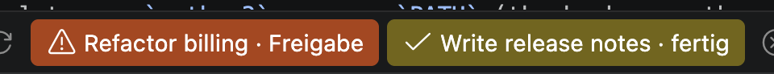
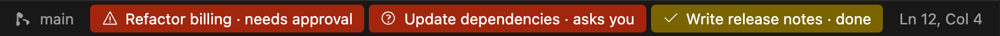

# Session Guard

<p align="center"><b><a href="../README.md#deutsch">🇩🇪 Deutsch</a> · <a href="../README.md#english">🇬🇧 English</a> · <a href="README.fr.md">🇫🇷 Français</a> · 🇮🇹 Italiano · <a href="README.es.md">🇪🇸 Español</a></b></p>

> 🇮🇹 **Vedi a colpo d'occhio quale sessione di Claude Code ha bisogno di te.** Session Guard mostra nella barra di
> stato di VS Code ogni sessione che ti sta aspettando: in rosso per un'autorizzazione o una domanda, in giallo quando
> una risposta è pronta. Un clic ti porta alla sessione, e un suono viene riprodotto solo quando ti viene posta
> davvero una domanda.



*La barra di stato con una sessione in attesa di autorizzazione (rossa) e una completata (gialla), qui con
l'interfaccia in tedesco.*



*I tre tipi di voce con l'interfaccia in inglese: autorizzazione e domanda (rosso), risposta completata (giallo).*

Lavori con diverse chat di Claude Code affiancate in VS Code. Una fa una domanda, un'altra aspetta un'autorizzazione,
una terza ha finito, e te ne accorgi solo quando le apri tutte una per una. Session Guard porta nella barra di stato di
VS Code ogni sessione che ti sta aspettando, e riproduce un suono solo quando ti viene posta davvero una domanda.

## Funzionalità

- **Una voce per ogni sessione in attesa**, con il titolo della sessione preso dall'elenco delle sessioni di
  Claude Code.
  - 🟥 **rosso:** Claude ha bisogno della tua autorizzazione o ti fa una domanda
  - 🟨 **giallo:** Claude ha completato una risposta che hai avviato tu
- **Clic per passare alla sessione:** carica la sessione nella barra laterale di Claude Code e rimuove la voce. Nessuna
  seconda scheda di chat.
- **Passando il mouse sopra** vedi da quanto tempo la sessione è in attesa e la domanda o l'ultima riga.
- **Suono solo per le domande** (AskUserQuestion, finestre di input MCP, sessioni in background in attesa di un
  input). Le autorizzazioni e le risposte completate restano silenziose.
- **Nessun falso allarme** per risposte che non sono davvero completate:
  - Claude prosegue da solo (ad esempio dopo un hook Stop): la voce scompare.
  - Le attività in background della sessione sono ancora in corso: non compare nulla finché non sono terminate.
  - La risposta è stata avviata da una pianificazione (`/loop`, cron): non compare nulla.
- Le voci scompaiono quando rispondi, quando Claude prosegue, quando ci clicchi sopra o (solo quelle gialle) dopo
  60 minuti.
- Interfaccia in tedesco, inglese, francese, italiano e spagnolo (segue la lingua di visualizzazione di VS Code).
- Tutto resta sul tuo computer. Nessun accesso alla rete, nessuna telemetria.

## Come funziona

```
Sessione Claude Code ──hook──▶ ~/.local/state/session-guard/sessions/<id>.json ──▶ estensione VS Code ──▶ barra di stato
                                                                        ▲
                       cronologia della sessione (~/.claude/projects/…) ┘  "è ancora in attesa?"
```

Il repository è composto da due parti:

| Parte | Cosa fa |
|---|---|
| **Plugin di Claude Code** (`hooks/`) | Un hook su `Stop`, `PreToolUse` (AskUserQuestion) e `Notification` scrive un piccolo file di stato JSON per ogni sessione e riproduce il suono delle domande. |
| **Estensione di VS Code** (`vscode/`) | Legge i file di stato ogni due secondi, controlla nella cronologia della sessione se la sessione è ancora in attesa e mostra le voci nella barra di stato. |

## Requisiti

- Claude Code con supporto per i plugin, usato nell'estensione di VS Code
- VS Code 1.90 o versione successiva
- Python 3.9 o versione successiva, disponibile come `python3` nel `PATH` (l'hook usa solo la libreria standard)
- macOS o Linux. **Windows:** usa il [branch `windows`](https://github.com/simon-says-labs/session-guard/tree/windows).

## Installazione

### 1. Plugin di Claude Code (l'hook)

In una sessione di Claude Code:

```
/plugin marketplace add simon-says-labs/session-guard
/plugin install session-guard@simon-says
```

### 2. Estensione di VS Code

Scarica `session-guard-<version>.vsix` dall'
[ultima release](https://github.com/simon-says-labs/session-guard/releases/latest) ed esegui:

```bash
code --install-extension session-guard-0.3.0.vsix
```

Se usi i [profili di VS Code](https://code.visualstudio.com/docs/configure/profiles), installa l'estensione in ogni
profilo in cui lavori, ad esempio con `--profile Work`. Senza `--profile` l'estensione viene installata solo nel
profilo predefinito.

Poi ricarica la finestra di VS Code (**Developer: Reload Window**, disponibile nel riquadro comandi). In questo modo si
riavviano anche le sessioni di Claude Code in quella finestra: Claude Code carica un plugin appena installato o
aggiornato solo all'avvio di una sessione, quindi fino ad allora le sessioni in corso mantengono i vecchi hook (o
nessuno).

## Configurazione

| Variabile d'ambiente | Effetto |
|---|---|
| `SESSION_GUARD_SOUND=off` | Nessun suono |
| `SESSION_GUARD_STATE=/percorso` | Cartella di stato diversa (impostala sia per Claude Code **sia** per VS Code) |

Ogni evento viene registrato con `sound=yes|no` in `~/.local/state/session-guard/session-guard.log`, così puoi
verificare perché un suono è stato riprodotto o meno.

## Limitazioni

Leggile prima di fare affidamento sull'estensione:

- **Comandi interni.** Il clic usa comandi interni dell'estensione Claude Code per VS Code
  (`claude-vscode.sidebar.open` e `claude-vscode.editor.open`), verificati l'ultima volta con la versione 2.1.288. Non
  sono un'API pubblica e possono cambiare. Se non funzionano, Session Guard ripiega sull'URI documentato
  `vscode://anthropic.claude-code/open?session=<id>`, che potrebbe aprire la sessione in una nuova scheda.
- **Formato della cronologia della sessione.** Se una sessione è ancora in attesa viene letto dalle cronologie delle
  sessioni di Claude Code. Il loro formato non è documentato ufficialmente.
- **Impostazione della barra laterale.** Un clic su una voce imposta la posizione preferita dell'estensione
  Claude Code sulla barra laterale (`claudeCode.preferredLocation`).
- **Windows** ha un proprio [branch `windows`](https://github.com/simon-says-labs/session-guard/tree/windows) (hook
  tramite `python`, suono tramite `winsound`, stato in `%LOCALAPPDATA%`). Questo branch chiama `python3` e riproduce
  il suono delle domande solo su macOS (`afplay`) e Linux (`paplay`).
- **Cronologie di grandi dimensioni.** L'hook legge la cronologia una volta per evento. Con cronologie da 40 a 60 MB
  questo richiede circa 0,75 s su un Apple M4 Pro.

## Disinstallazione

```
/plugin uninstall session-guard@simon-says
code --uninstall-extension simon-says-labs.session-guard
```

Dopodiché puoi rimuovere la cartella di stato `~/.local/state/session-guard`.

## Sviluppo

```bash
python3 -m unittest discover -s tests/python   # hook
node --test tests/node/*.test.js               # estensione
python3 vscode/build_vsix.py                   # scrive dist/session-guard-<version>.vsix
claude plugin validate .                       # manifest del plugin e del marketplace
```

L'estensione non ha dipendenze npm e non richiede alcuna fase di build. Vedi
[CONTRIBUTING.md](../CONTRIBUTING.md).

## Licenza

[MIT](../LICENSE) © 2026 Simon Eckmiller · pubblicato da [Simon Says](https://github.com/simon-says-labs)

Questo è un progetto indipendente della community. Non è affiliato ad Anthropic né approvato da Anthropic.

<p align="right"><a href="#session-guard">↑</a></p>
